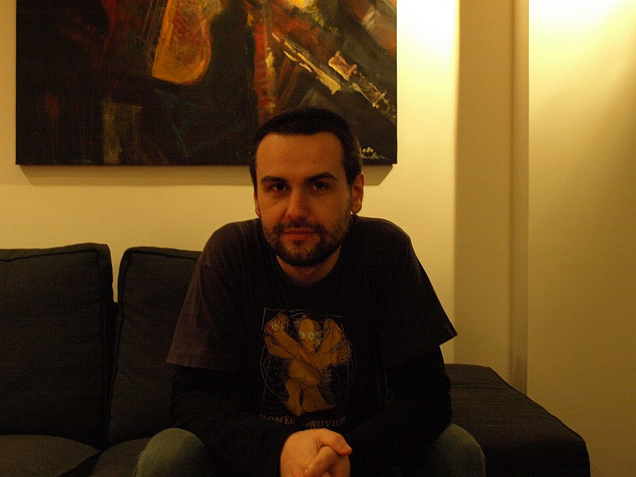

 
<b>Cosmin Apreutesei</b>
 
Bucharest, RO

I learned to program in 5^th^ grade on a Z80, and later on on a 486 and
never stopped since. I got my first paying job at 17 when I wrote an online
shop in php.

I write my code in Lua when I can, and in Python and Javascript when I can't.
I will also program in Java, C++, C# and ObjC under some types of threats
or extreme poverty. I still have a thing for relational databases. I will try
to make a DSL when I can. Sometimes I meet people who use C for everything,
and then I move on.

In the past I did a lot of Delphi in smokey apartment-sized companies full
of smart people, and then more Delphi in mall-sized corporations full of
droids and a one-hour commute. I even worked in a php farm for one month.
My last job was at [sellerengine](http://sellerengine.com/) where I developed
products for large amazon sellers.

I currently live in Bucharest, and work as a freelancer.

My most significant project to date is luapower, the place which gets most of
the output of my current research interests, which include vector graphics,
GUIs, and p2p networks.

I am a market anarchist and a philosopher. I value peaceful parenting and
animal welfare and I owe my current education to Ayn Rand, Stefan Molyneux,
Ludwig Von Mises, Robert P. Murphy, Frank Lloyd Wright, Christopher Alexander,
Douglas Engelbart, and others.

Cosmin,\
December 8, 2014
